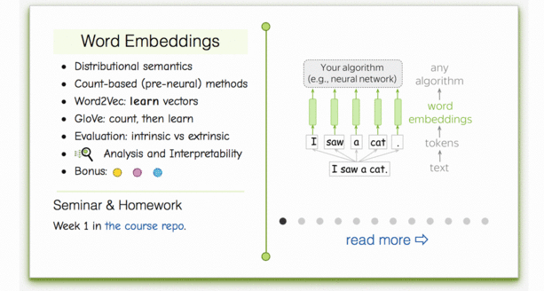
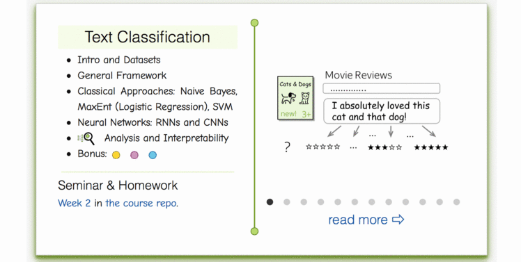
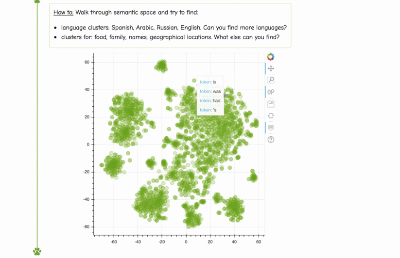
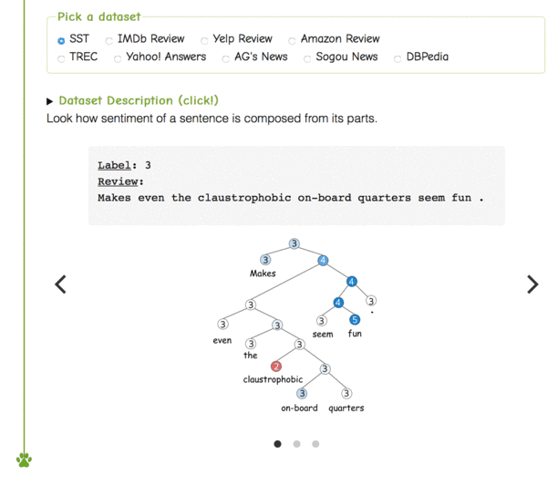

## Week 01: Word Embeddings

### Materials
- Lecture slides: [Google Drive (embeddings)](https://drive.google.com/file/d/1y2GKIKBzie7l8iycBO6gTKGiTTfJc4Dr/view), [Google Drive (classification)](https://drive.google.com/file/d/1f7vQGNRe1PQi6WnEdCZbtf_zmx6fF8g1/view)
- Video (Russian): [lecture & seminar](https://disk.yandex.ru/i/mygl3L-gzgbUfA)
- Video (English): Stanford CS224N - [intro](https://www.youtube.com/watch?v=OQQ-W_63UgQ), [embeddings](https://www.youtube.com/watch?v=rmVRLeJRkl4), [text classification](https://www.youtube.com/watch?v=nzSPZyjGlWI)

### Practice
The practice for this week takes place in notebooks. Just open them and follow instructions from there.
- Seminar: [`./seminar.ipynb`](./seminar.ipynb) 
- Homework: [`./homework.ipynb`](./homework.ipynb)
- **Enrolled students:** Submit both `seminar.ipynb` and `homework.ipynb` to the LMS system for full points!

### Lecture-blog, research thinking exercises, related papers and fun: 
####  [NLP Course For You](https://lena-voita.github.io/nlp_course.html#preview_word_emb) 

####  [NLP Course For You](https://lena-voita.github.io/nlp_course.html#preview_text_clf) 

### Take a walk through space... Semantic Space!
####  [NLP Course For You](https://lena-voita.github.io/nlp_course/word_embeddings.html#analysis_interpretability) 

### Dataset viewer:
####  [NLP Course For You](https://lena-voita.github.io/nlp_course/text_classification.html#dataset_examples) 

### More materials (optional)
* On hierarchical & sampled softmax estimation for word2vec [page](http://ruder.io/word-embeddings-softmax/)
* [Alternative explanation of Word2Vec negative sampling](https://arxiv.org/pdf/1402.3722.pdf)
* GloVe project [page](https://nlp.stanford.edu/projects/glove/)
* FastText project [repo](https://github.com/facebookresearch/fastText)
* Another cool link that you could have shared, but decided to hesitate. Or did you?
* Colah's blog on convolutions, including text convolutions - [url](http://colah.github.io/posts/2014-07-Understanding-Convolutions/)
* Same architectures applied for music - [blog post](http://benanne.github.io/2014/08/05/spotify-cnns.html)
