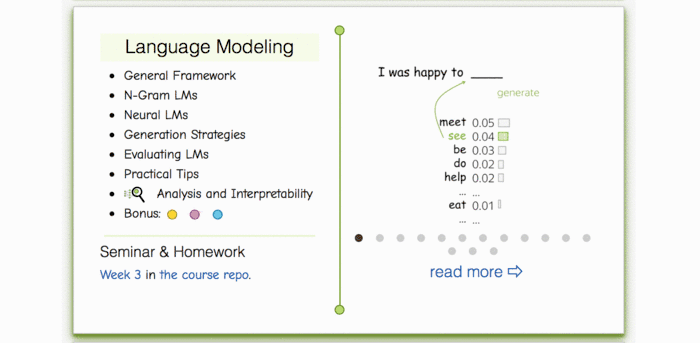
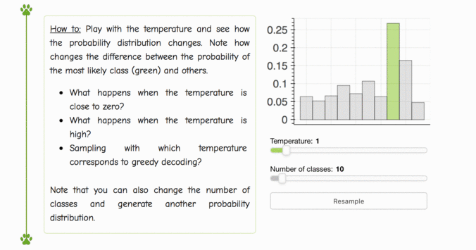

## Week 02: Language Models

### Materials
- Lecture slides: [`./lecture_lm.pdf`](./lecture_lm.pdf) ([Google Slides](https://docs.google.com/presentation/d/16CTpXAYwIiVuv8nbe729C4_olGYwilhH/edit))
- Video (Russian): [lecture](https://disk.yandex.ru/i/E4NlokgRT6Ci6g), [seminar](https://disk.yandex.ru/i/mSewi0SUky5h6g)
- From other courses (English): Stanford NLP - [N-gram language models](https://archive.org/details/41IntroductionToNGramsStanfordNLPProfessorDanJurafskyChrisManning/), [neural language models](https://www.youtube.com/watch?v=Keqep_PKrY8)

### Practice
- Seminar: [`./seminar.ipynb`](./seminar.ipynb) 
- Homework: [`./homework_pytorch.ipynb`](./homework_pytorch.ipynb)

### Lecture-blog, research thinking exercises, related papers and fun:
####  [NLP Course For You](https://lena-voita.github.io/nlp_course.html#preview_lang_models)

### Play with softmax temperature:
####  [NLP Course For You](https://lena-voita.github.io/nlp_course/language_modeling.html#generation_strategies_temperature)

### Extra materials
- CS231 lecture on RNNs by Andrej Karpathy, 2016 - [video](https://www.youtube.com/watch?v=iX5V1WpxxkY) (English)
- A more detailed lecture by Y. Bengio, 2016 - [video](https://www.youtube.com/watch?v=xK-bzjIQkmM)
- Great reading by A. Karpathy, 2015 - [The Unreasonable Effectiveness of Recurrent Neural Networks](http://karpathy.github.io/2015/05/21/rnn-effectiveness/)
- LSTM explained in detail by Christopher Olah (Anthropic), 2015 - [Understanding LSTM Networks](http://colah.github.io/posts/2015-08-Understanding-LSTMs/)
- ["Awesome RNNs"](https://github.com/kjw0612/awesome-rnn) - a curated list of resources dedicated to recurrent neural networks

