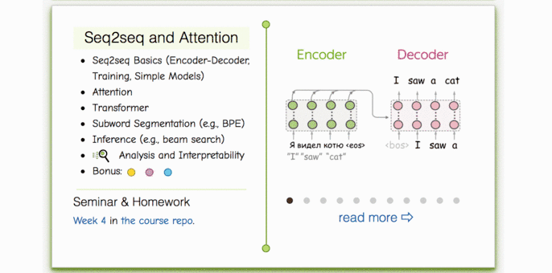

## Week 03: Seq2seq and Attention

### Materials
- Lecture slides: [Google Slides](https://docs.google.com/presentation/d/1O2A22-gN6BB7WPfWUHXuGzCm88_NTuHq/edit?usp=sharing&rtpof=true&sd=true)
- Video (Russian): [lecture](https://disk.yandex.ru/i/fQHnwptCHH2Owg), [seminar](https://disk.yandex.ru/i/DKCQJU-VG0vVcQ)
- From other courses (English): Stanford - [seq2seq and MT](https://www.youtube.com/watch?v=IxQtK2SjWWM) | CMU - [seq2seq](https://www.youtube.com/watch?v=aHkgjfKvIhk&list=PL8PYTP1V4I8Ba7-rY4FoB4-jfuJ7VDKEE&index=20), [attention](https://www.youtube.com/watch?v=ullLRKZ99qQ&index=21&list=PL8PYTP1V4I8Ba7-rY4FoB4-jfuJ7VDKEE)

### Practice
This time we're using a shared notebook for both seminar and homework.
- Practice & Homework: [`./new_practice_and_homework.ipynb`](./new_practice_and_homework.ipynb) 

### Lecture-blog, research thinking exercises, related papers and fun: 
####  [NLP Course For You](https://lena-voita.github.io/nlp_course.html#preview_seq2seq_attn) 

### Extra materials
- Distill.pub post on attention and augmentations for RNN - [post](https://distill.pub/2016/augmented-rnns/)
- Seq2seq lecture - [video](https://www.youtube.com/watch?v=G5RY_SUJih4)
- [BLEU](http://www.aclweb.org/anthology/P02-1040.pdf) and [CIDEr](https://arxiv.org/pdf/1411.5726.pdf) articles.
- Image captioning
  - MSCOCO captioning [challenge](http://mscoco.org/dataset/#captions-challenge2015)
  - Captioning baseline [notebook](https://github.com/yandexdataschool/Practical_DL/tree/fall18/week07_seq2seq)
- Illustrated transformer [post](https://jalammar.github.io/illustrated-transformer/)

