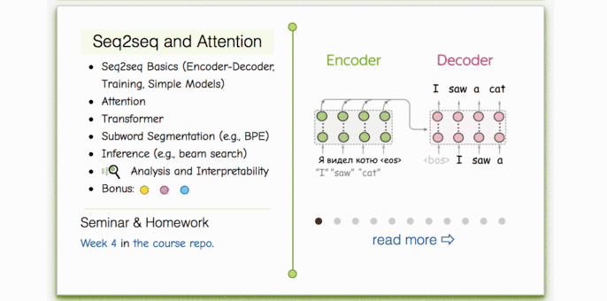

### Materials
* [__Lecture slides__](https://drive.google.com/file/d/1inle88uyRI-a3ghxdVrqhhmukqywb3Hy/view?usp=sharing) 
* Our videos (russian): [lecture](https://disk.yandex.ru/i/dw2pITTCXTWXeA), [seminar](https://disk.yandex.ru/i/zBqTYJeoClnozw)
* Stanford lecture on seq2seq and MT (english) - [video](https://www.youtube.com/watch?v=IxQtK2SjWWM)
* Alternative CMU lectures - [seq2seq](https://www.youtube.com/watch?v=aHkgjfKvIhk&list=PL8PYTP1V4I8Ba7-rY4FoB4-jfuJ7VDKEE&index=20) and [attention](https://www.youtube.com/watch?v=ullLRKZ99qQ&index=21&list=PL8PYTP1V4I8Ba7-rY4FoB4-jfuJ7VDKEE)

### Practice
This time we're gonna use a shared `practice_and_homework_pytorch.ipynb` for both seminar and homework.

Seminar .

### Lecture-blog, research thinking exercises, related papers and fun: 
####  [NLP Course For You](https://lena-voita.github.io/nlp_course.html#preview_seq2seq_attn) 

### More on RNN
* Distill.pub post on attention and augmentations for RNN - [post](https://distill.pub/2016/augmented-rnns/)
* Seq2seq lecture - [video](https://www.youtube.com/watch?v=G5RY_SUJih4)
* [BLEU](http://www.aclweb.org/anthology/P02-1040.pdf) and [CIDEr](https://arxiv.org/pdf/1411.5726.pdf) articles.
* Image captioning
  * MSCOCO captioning [challenge](http://mscoco.org/dataset/#captions-challenge2015)
  * Captioning baseline [notebook](https://github.com/yandexdataschool/Practical_DL/tree/fall18/week07_seq2seq)

### More on Transformer
* Illustrated transformer [post](https://jalammar.github.io/illustrated-transformer/)

