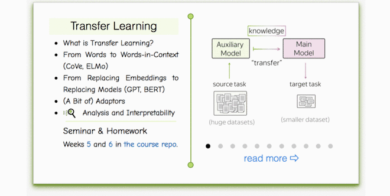

## Week 04: Transfer Learning

### Materials
- Lecture slides: [`./lecture_transfer.pdf`](./lecture_transfer.pdf) ([Google Drive](https://drive.google.com/file/d/1MYEajlQeG7w4VftF-GGs7em5pTVYsquJ/view)) | [`./scheme.pdf`](./scheme.pdf)
- Video (Russian): [lecture](https://disk.yandex.ru/d/67t4HiLi_Cm2Eg), [seminar](https://disk.yandex.ru/d/Jp9-ZRMzvWc7jQ)
- From other courses (English): [document classification tutorial](https://www.youtube.com/watch?v=_eSGWNqKeeY)
- Alternative (2023 course): [lecture](https://disk.yandex.ru/i/7EAl1vWEkusMTA), [seminar](https://disk.yandex.ru/i/KgOmuhkdLQhf4Q) — may be explained more clearly, better, or differently
- Additional: Hugging Face [quick tour tutorial](https://huggingface.co/docs/transformers/quicktour) (recommended)

### Practice
- Seminar: [`./seminar.ipynb`](./seminar.ipynb) 
- Homework: [`./homework.ipynb`](./homework.ipynb)
- **Enrolled students:** Please submit both seminar and homework notebooks into the grading system

### Lecture-blog, research thinking exercises, related papers and fun: 
####  [NLP Course For You](https://lena-voita.github.io/nlp_course.html#preview_transfer) 

