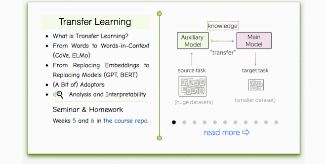

### Materials
* [__Lecture slides__](https://drive.google.com/file/d/1MYEajlQeG7w4VftF-GGs7em5pTVYsquJ/view?usp=sharing) 
* Our videos (russian) - [lecture](https://disk.yandex.ru/i/aWmk4LrVotbArg), [seminar](https://disk.yandex.ru/i/-0vzr1mAooLIiQ)
* Huggingface [quick tour tutorial](https://huggingface.co/docs/transformers/quicktour) (recommended)
* A related [video](https://www.youtube.com/watch?v=_eSGWNqKeeY) tutorial for document classification (english)

### Practice
* Seminar - 
* Homework: `./homework.ipynb`
* If you are enrolled for this course, __please submit both seminar and homework notebooks into the grading system__

### Lecture-blog, research thinking exercises, related papers and fun: 
####  [NLP Course For You](https://lena-voita.github.io/nlp_course.html#preview_transfer) 

