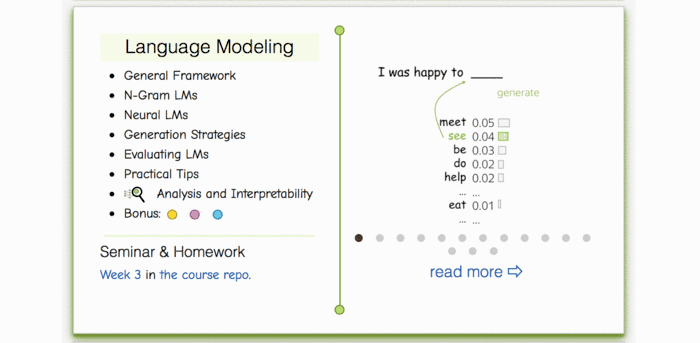

Slides - TBU

* [__Lecture slides__](https://drive.google.com/file/d/1ueMYgH3qhsjn3X6K_mcnMvYjjh9Zvl01/view?usp=sharing) 
* Our videos (russian) - [lecture](https://yadi.sk/i/81nP3AcDIrBE5g), [seminar](https://yadi.sk/i/b_64Rs1anbTx9A)
* Seminar -  
* Huggingface quickstart [tutorial](https://huggingface.co/transformers/quickstart.html) (recommended)
* A related [video](https://www.youtube.com/watch?v=_eSGWNqKeeY) tutorial for document classification (english)

### Lecture-blog, research thinking exercises, related papers and fun: 
####  [NLP Course For You](https://lena-voita.github.io/nlp_course.html#preview_lang_models) 

